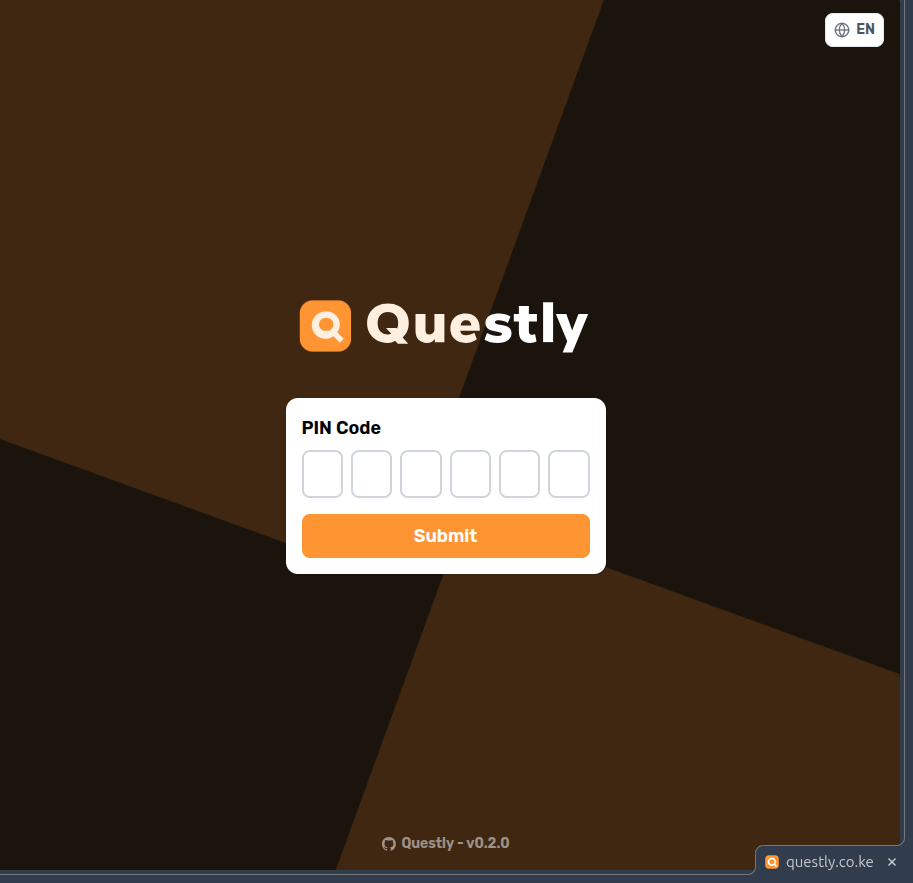
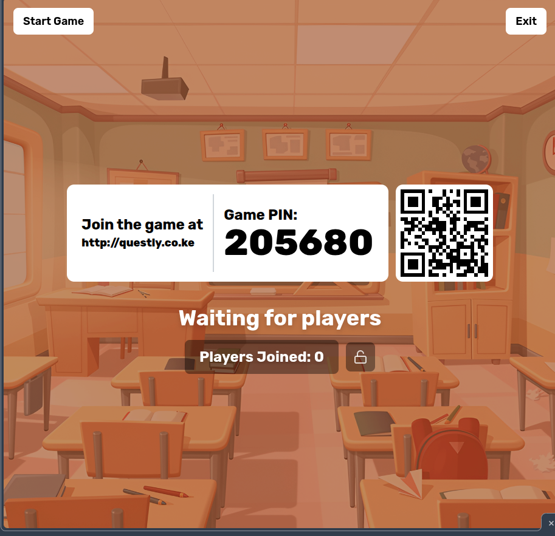
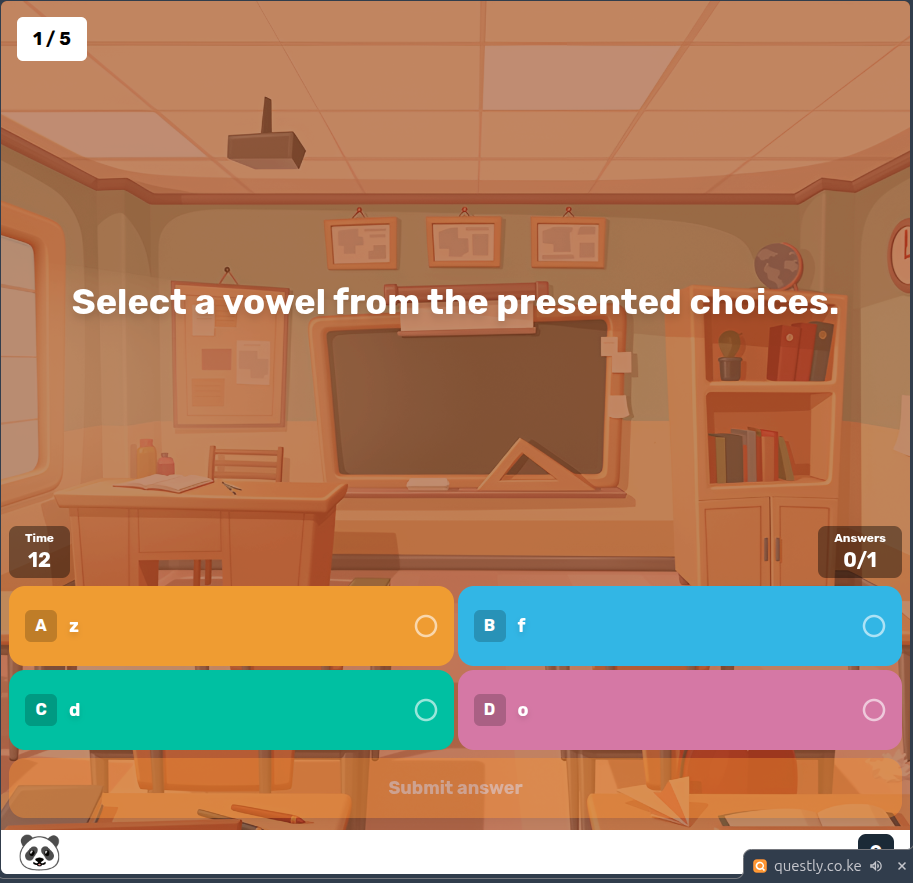
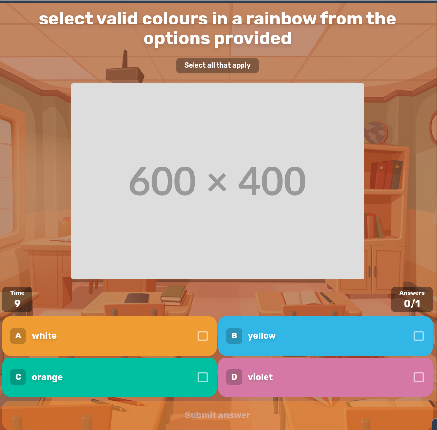
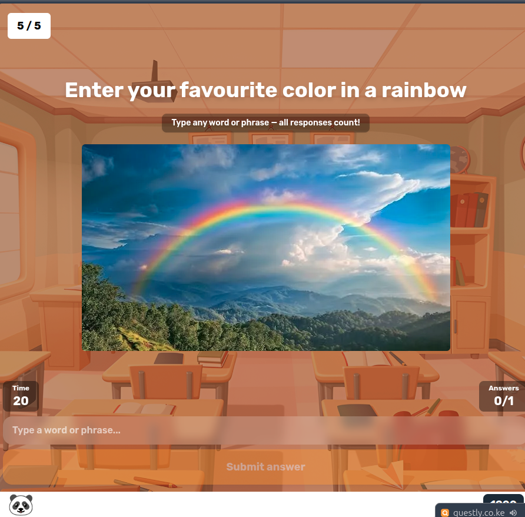
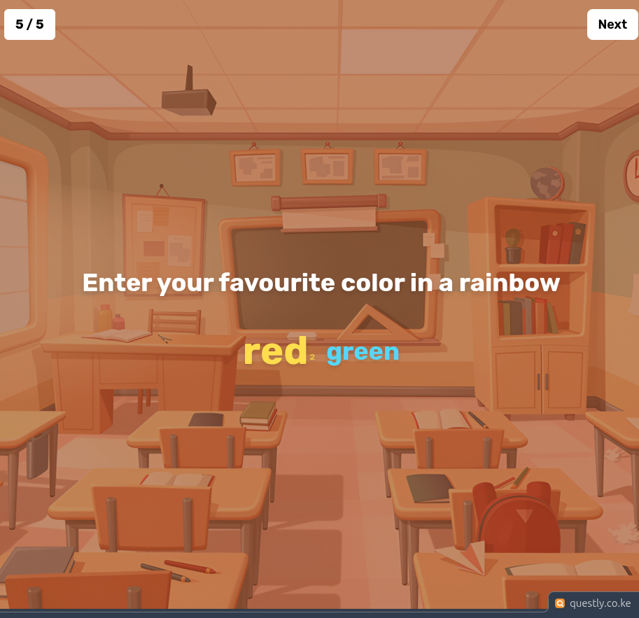
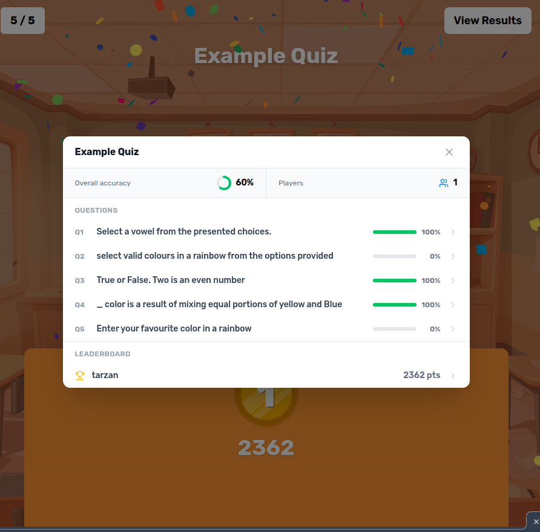
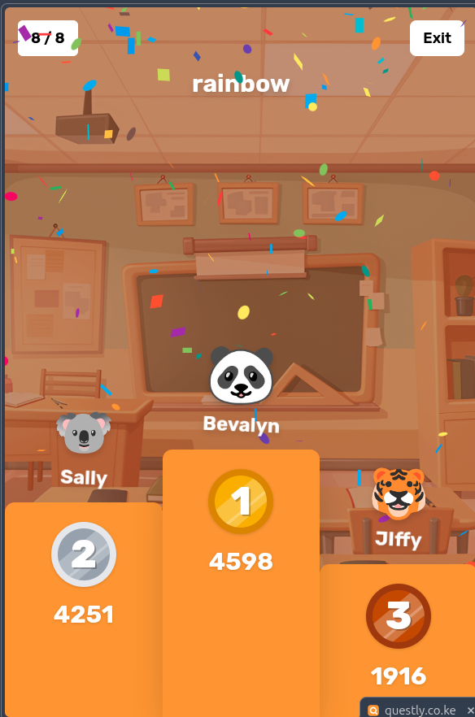

<p align="center">
  
  <br>
  <div align="center">
    
    
  </div>
</p>

## 🧩 What is this project?

Questly is a straightforward and open-source quiz platform, allowing users to host it on their own server for smaller events.

> **Disclaimer**: Questly is an independent, open-source software project. It is not affiliated with, endorsed by, or sponsored by any third-party quiz platform or service. Any resemblance to other quiz platforms is purely incidental.

<p align="center">
  
  
  
</p>
<p align="center">
  
  
  
</p>
<p align="center">
  
  
</p>

## ⚙️ Prerequisites

Choose one of the following deployment methods:

### Without Docker

- Node.js : version 22 or higher
- PNPM : version 10.16 or higher (learn more [here](https://pnpm.io/))

### With Docker

- Docker and Docker Compose

## 📖 Getting Started

Choose your deployment method:

### 🐳 Using Docker (Recommended)

Using Docker Compose (recommended):
You can find the docker compose configuration in the repository:
[docker-compose.yml](/compose.yml)

```bash
docker compose up -d
```

Or using Docker directly:

```bash
docker run -d \
  -p 3000:3000 \
  -v ./config:/app/config \
  questly-co/questly:latest
```

**Configuration Volume:**
The `-v ./config:/app/config` option mounts a local `config` folder to persist your game settings and quizzes. This allows you to:

- Edit your configuration files directly on your host machine
- Keep your settings when updating the container
- Easily backup your quizzes and game configuration

The folder will be created automatically on first run with an example quiz to get you started.

The application will be available at http://localhost:3000

### 🛠️ Without Docker

1. Clone the repository:

```bash
git clone https://github.com/questly-co/Questly.git
cd ./Questly
```

2. Install dependencies:

```bash
pnpm install
```

3. Build and start the application:

```bash
# Development mode
pnpm run dev

# Production mode
pnpm run build
pnpm start
```

## ⚙️ Configuration

The configuration is split into two main parts:

### 1. Game Configuration (`config/game.json`)

Main game settings:

```json
{
  "managerPassword": "PASSWORD"
}
```

Options:

- `managerPassword`: The master password for accessing the manager interface. **Must be changed from the default `"PASSWORD"` value**, otherwise manager access is blocked.

### 2. Quiz Configuration (`config/quizz/*.json`)

Quizzes can be created in two ways:

- **Via the Quiz Editor** — use the built-in editor available in the manager dashboard (recommended)
- **Via JSON files** — manually create files in the `config/quizz/` directory

You can have multiple quiz files and select which one to use when starting a game.

#### Question Types

| Type | `type` value | Description |
|---|---|---|
| Single choice | `"single"` (default) | One correct answer from 2–4 options |
| Multiple choice | `"multiple"` | One or more correct answers from 2–4 options |
| True / False | `"truefalse"` | Two-option true/false question |
| Short answer | `"shortanswer"` | Players type a free-text answer matched against accepted answers |

#### Example quiz (`config/quizz/example.json`)

```json
{
  "subject": "Example Quiz",
  "questions": [
    {
      "question": "What is the capital of France?",
      "type": "single",
      "answers": ["Berlin", "Paris", "Madrid", "Rome"],
      "solutions": [1],
      "cooldown": 5,
      "time": 15
    },
    {
      "question": "Which of these are primary colors?",
      "type": "multiple",
      "answers": ["Red", "Green", "Blue", "Yellow"],
      "solutions": [0, 2, 3],
      "cooldown": 5,
      "time": 20
    },
    {
      "question": "The Earth is flat.",
      "type": "truefalse",
      "answers": ["True", "False"],
      "solutions": [1],
      "cooldown": 5,
      "time": 10
    },
    {
      "question": "What is the chemical symbol for water?",
      "type": "shortanswer",
      "textSolutions": ["H2O", "h2o"],
      "cooldown": 5,
      "time": 20
    },
    {
      "question": "What is the correct answer with an image?",
      "type": "single",
      "answers": ["No", "Yes", "No", "No"],
      "media": {
        "type": "image",
        "url": "https://placehold.co/600x400.png"
      },
      "solutions": [1],
      "cooldown": 5,
      "time": 20
    }
  ]
}
```

#### Question fields

- `question`: The question text
- `type`: Question type — `"single"` (default), `"multiple"`, `"truefalse"`, or `"shortanswer"`
- `answers`: Array of 2–4 answer options (not used for `shortanswer`)
- `solutions`: Array of correct answer indices, 0-based (not used for `shortanswer`)
- `textSolutions`: Array of accepted text answers for `shortanswer` questions (case-insensitive matching)
- `media` _(optional)_: Media displayed alongside the question
  - `type`: `"image"`, `"video"`, or `"audio"`
  - `url`: URL of the media
- `cooldown`: Seconds before answers are revealed (3–15)
- `time`: Seconds allowed to answer (5–120, or `-1` for no time limit)

## 🌍 Supported Languages

The interface is available in the following languages, selectable from the settings menu:

| Language | Code |
|---|---|
| English | `en` |
| German | `de` |
| Spanish | `es` |
| French | `fr` |
| Italian | `it` |
| Japanese | `ja` |
| Swahili | `sw` |

## 🎮 How to Play

1. Access the manager interface at http://localhost:3000/manager
2. Enter the manager password (defined in `config/game.json`)
3. Share the game URL (http://localhost:3000) and room code with participants
4. Wait for players to join
5. Click the start button to begin the game

## 📝 Contributing

Contributions are welcome! Please read the [CONTRIBUTING.md](.github/CONTRIBUTING.md) guide before submitting a pull request.

For bug reports or feature requests, please [create an issue](https://github.com/questly-co/Questly/issues).

## ⭐ Star History

[](https://www.star-history.com/#questly-co/Questly&type=date&legend=bottom-right)
